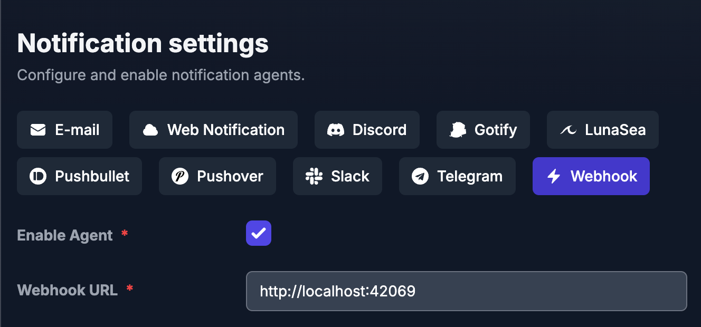

# Jellyping

Jellyping is a Go-based application that integrates with Jellyseer and Telegram to provide notifications and user management features.

## Why just not use the default Telegram notifications that Jellyseer provides?
In my experience, the only way to use Jellyseer Telegram notifications is to create a bot and make it manage a channel. That way every user in my Jellyfin needs to subscrive to that channel and gets notification for stuff they don't bother at all mixed with media requested from them. Jellyping solves this problem making the bot contact you directly with an update about **your** requested media.

## Features
- Telegram bot integration for notifications and commands
- Jellyfin user import and management

## Prerequisites
- Docker & Docker Compose
- Jellyseer
- Telegram Bot Token
- Jellyfin server URL and API key

## Installation

1. **Clone the repository:**
   ```sh
   git clone https://github.com/SaltySpaghetti/jellyping.git
   cd jellyping
   ```
2. **Copy and edit the environment variables:**
   ```sh
   cp .env.example .env
   ```
3. **Run with Docker Compose:**
   ```sh
   docker compose up -d
   ```
   Or run locally:
   ```sh
   go run main.go
   ```

## Set URL inside Jellyseer

In Jellyseer, go to **Settings > Notifications**, enable the **Webhook** agent, and set the Webhook URL to your running Jellyping instance with http://localhost:42069. Customize which notifications you want to receive, then make sure to save your changes.

## Usage
Contact your bot directly on Telegram sending the `/username` command followed by your usename on Jellyfin. If the provided username doesn't match you'll get an error.

## Customization
| Variable           | Required | Description                        |
|--------------------|:--------:|------------------------------------|
| TELEGRAM_BOT_TOKEN |   Yes    | Telegram bot token                 |
| JELLYFIN_URL       |   Yes    | Jellyfin server URL                |
| JELLYFIN_API_KEY   |   Yes    | Jellyfin API key                   |
| PORT               |    No    | Port for the application           |
| POSTGRES_USER      |    No    | PostgreSQL username                |
| POSTGRES_PASSWORD  |    No    | PostgreSQL password                |
| POSTGRES_DB        |    No    | PostgreSQL database name           |

## Contributing
Pull requests are welcome! For major changes, please open an issue first to discuss what you would like to change.